# CiteFlow — Your Brand's AI Search Agent

[](https://www.gnu.org/licenses/agpl-3.0)
[](https://www.python.org/)
[](https://nextjs.org/)

> **51.5% of Google queries now get AI answers. Your SEO is buying visibility on a shrinking screen.**
>
> CiteFlow diagnoses how AI search engines (ChatGPT, Gemini, Claude, Perplexity) see your brand — then gives you page-level prescriptions to get cited, recommended, and trusted.

---

## One Command

```bash
git clone https://github.com/fong-foo/citeflow.git && cd citeflow
pip install -r requirements.txt
python3 examples/run-demo.sh
```

No API keys needed for the demo. For real scans, set `OPENAI_API_KEY` and `DEEPSEEK_API_KEY`.

---

## What CiteFlow Does

```
Probe → Analyst → Doctor → Re-Probe (closed loop)
```

| Agent | Role | What It Produces |
|-------|------|-----------------|
| **Probe** | Reconnaissance | Multi-engine citation scan: which AI engines cite you, at what rate, for which queries |
| **Analyst** | Diagnosis | 15-rule engine detects identity drift, citation blind spots, competitor vulnerabilities |
| **Doctor** | Prescription | Page-level action items (P0/P1/P2) with copy-paste templates, evidence, and verification steps |

**Probe scans 3 query categories across 3 AI engines:**
- **Category A** — Industry queries ("best eco-friendly phone case")
- **Category B** — Brand queries ("Pela Case review")  
- **Category C** — Competitor queries ("Pela Case vs Casetify")

**Analyst applies 15 diagnostic rules** covering identity alignment, citation quality, source diversity, cross-engine stability, multimodal blind spots, and adversarial competitor detection.

**Doctor generates CITE-framework prescriptions** (Content, Identity, Trust, Engagement) backed by 35 research papers via vector search.

---

## What's Inside

```
agents/
├── probe/probe_node.py          # Multi-engine scan orchestration (async pipelines)
├── analyst/
│   ├── analyst_node.py          # Diagnosis engine (LLM + rule validation)
│   ├── analyst_rules.py         # 15-rule detection engine
│   ├── analyst_prompt.py        # System prompt + Few-Shot + analysis frameworks
│   └── analyst_context.py       # ProbeOutput → LLM context builder
├── doctor/
│   ├── doctor_node.py           # Prescription generator (LLM + knowledge injection)
│   └── doctor_prompt.py         # Doctor system prompt + Few-Shot
├── knowledge_loader.py          # RAG vector search (ChromaDB) over 35 papers
├── state.py                     # Pydantic data models (40+ models)
├── config.py                    # Configuration (all keys via environment variables)
└── tools/                       # 14 tool modules
    ├── brand_profiler.py        # Website crawling + brand profile extraction
    ├── query_expander.py        # Seed query → 30 classified search queries
    ├── fc_search.py             # Multi-engine search + Serper fallback
    ├── citation_analyzer.py     # Citation detection + 4-layer hallucination defense
    ├── market_mirror.py         # AI perception analysis
    ├── gap_analysis.py          # Brand self-image vs AI perception gap
    ├── company_scorer.py        # 5-dimension weighted scoring
    ├── competitor_query_gen.py  # Competitor query generation + comparison
    ├── source_authority.py      # Citation source authority evaluation
    ├── ai_narrative.py          # AI-optimized brand narrative generation
    ├── embedding.py             # OpenAI-compatible text-embedding-3-small
    ├── analyst_briefing.py      # Analyst briefing assembly
    └── data_store.py            # SQLite storage + historical comparisons

knowledge/
├── papers/                      # 35 GEO research papers (JSON)
├── strategies/                  # 123 extracted strategies
├── templates/                   # 7 prescription templates (Chinese)
├── industries/                  # 5 industry playbooks
├── platforms/                   # 3 platform guides
├── regions/                     # Cross-border region guides
└── frameworks/                  # CITE diagnostic framework

tools/
├── ai-crawlers/                 # AI crawler User-Agent checklist + robots.txt validator
└── llms-txt/                    # llms.txt generator + validator

frontend/                        # Next.js 16 UI components
├── analyst-report.tsx           # 6-module diagnostic report
├── doctor-workshop.tsx          # Prescription workshop (P0/P1/P2 cards)
└── dashboard.tsx                # Brand health dashboard
```

---

## 🖼️ Product Screenshots

| | | |
|:---:|:---:|:---:|
| **Multi-Engine Comparison** | **Engine Insights** | **Citation Metrics** |
| 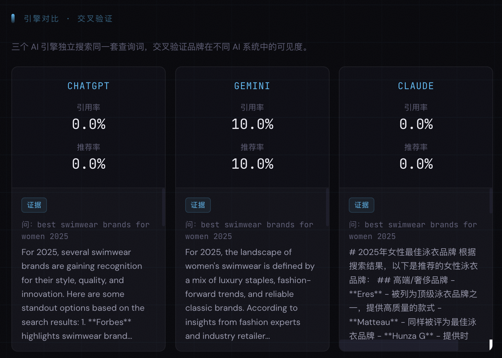 | 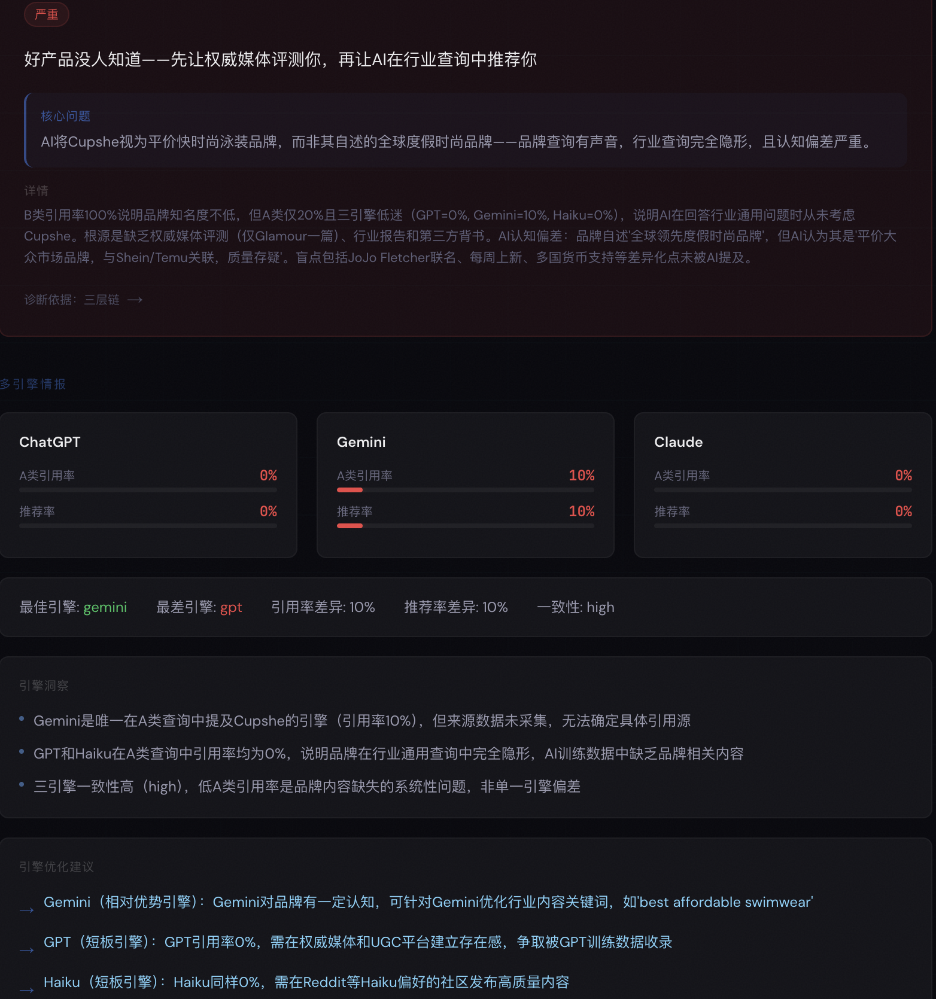 | 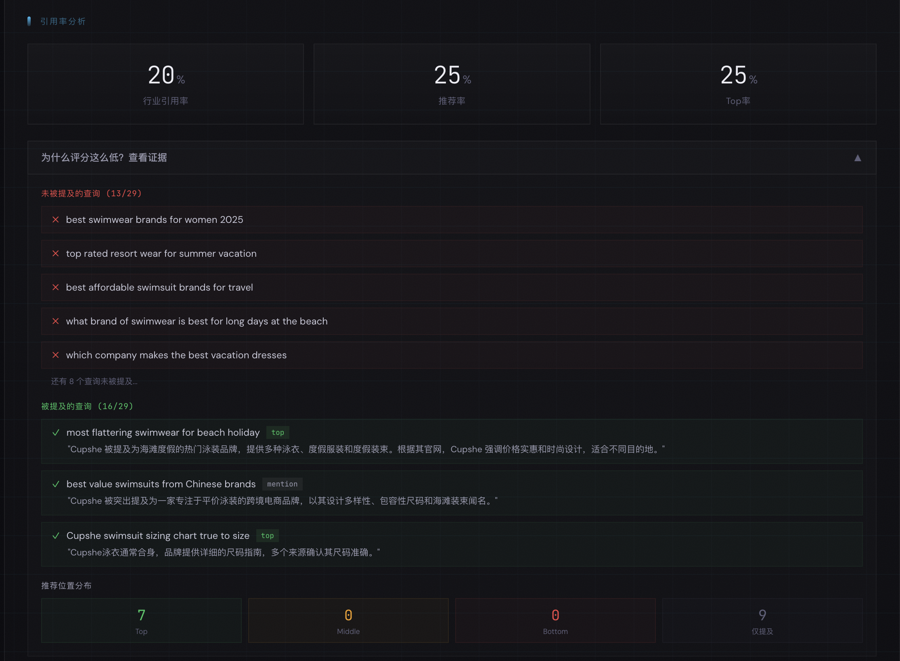 |
| **Brand Diagnosis** | **AI Perception** | **Source Authority** |
| 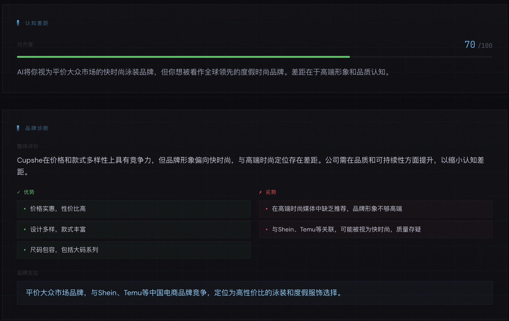 | 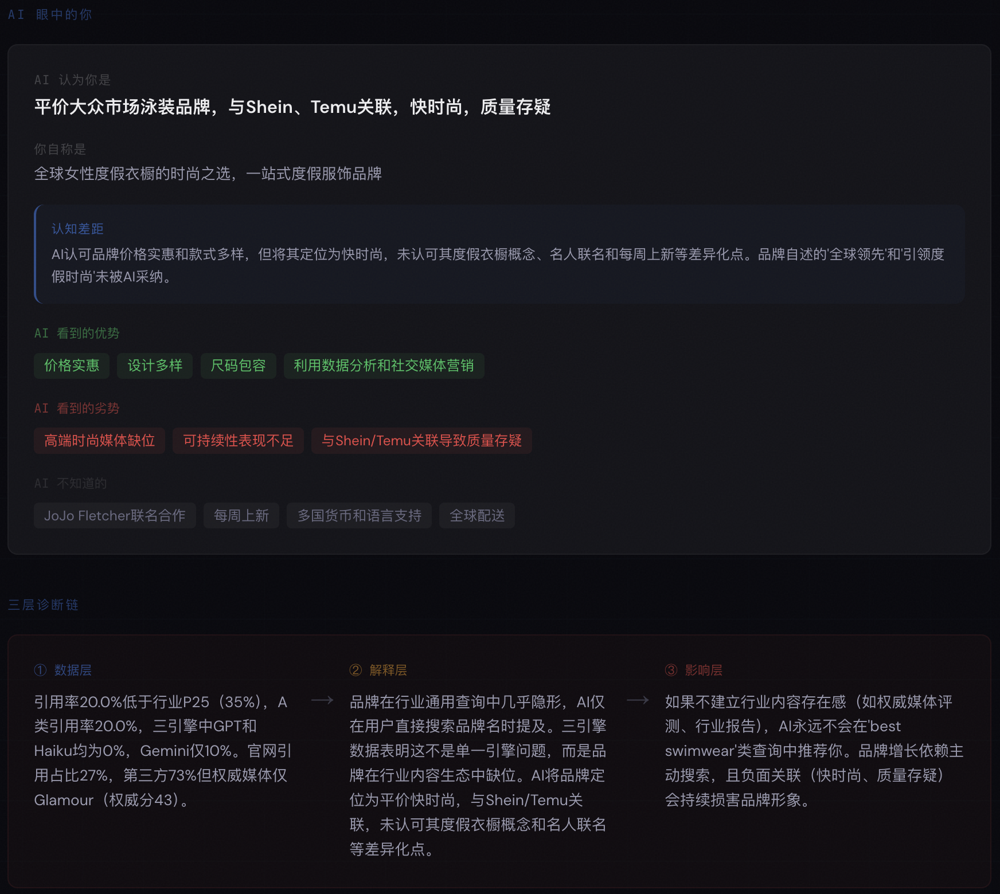 | 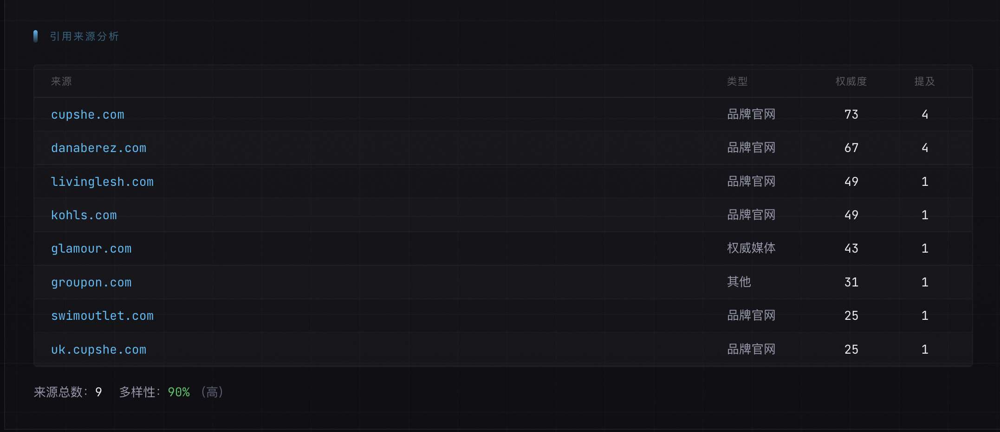 |
| **Competitor Analysis** | **Risk Alerts** | **Mention Details** |
| 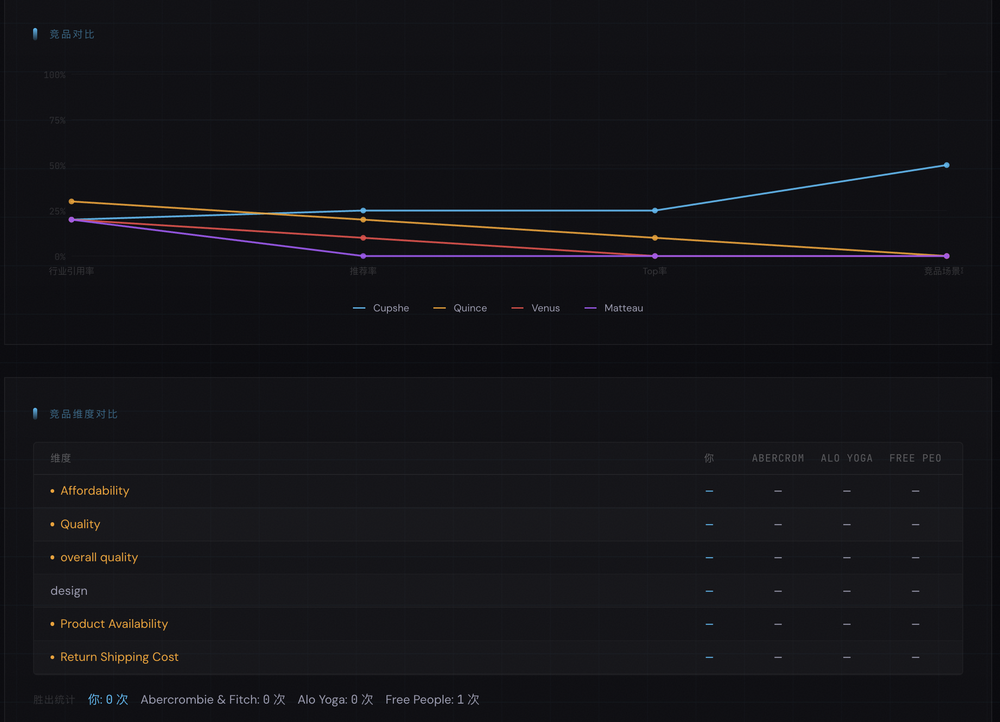 | 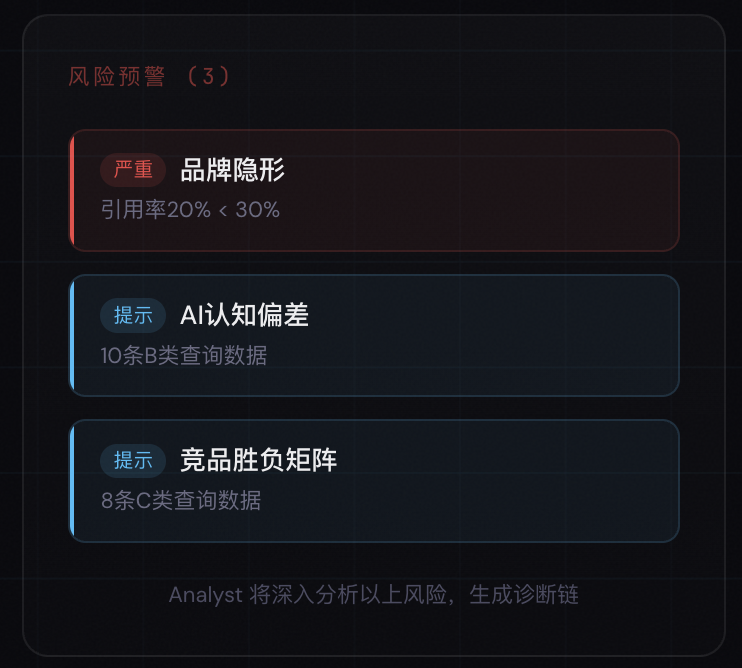 | 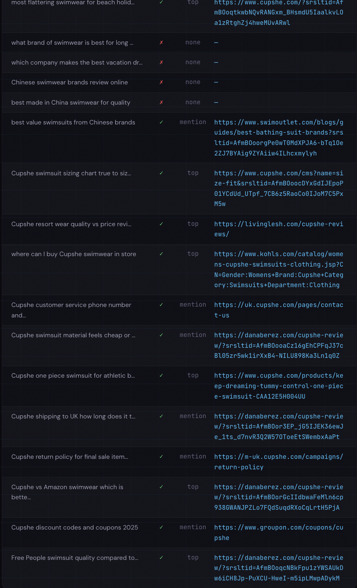 |
| **Doctor Strategy** | **Doctor P0/P1/P2** | **Brand Archive** |
| 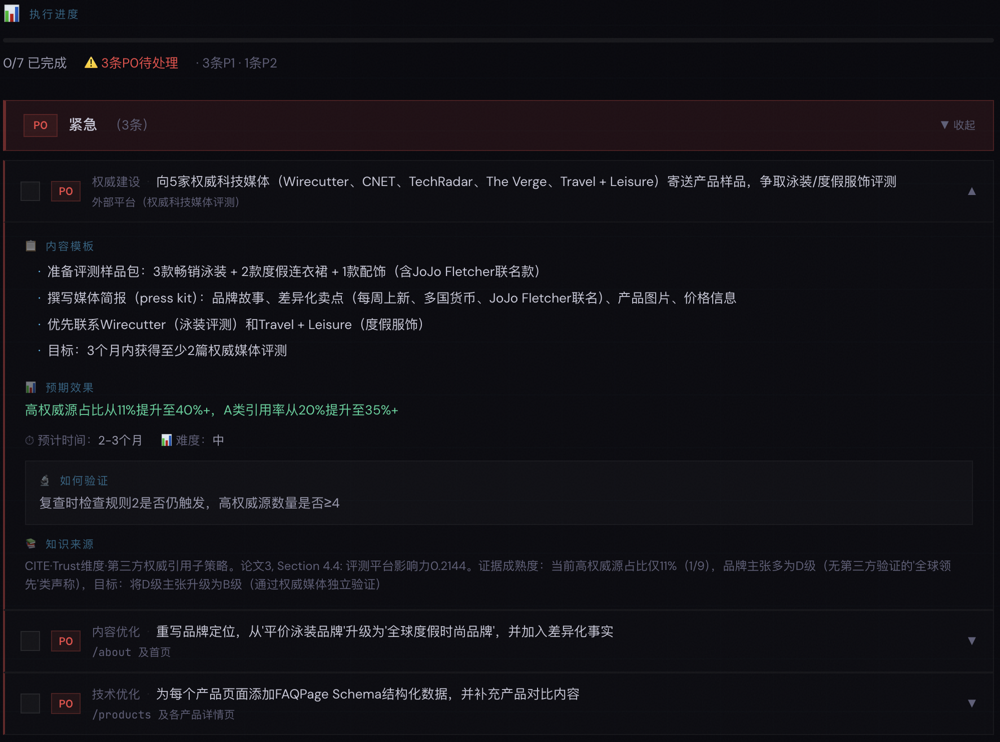 | 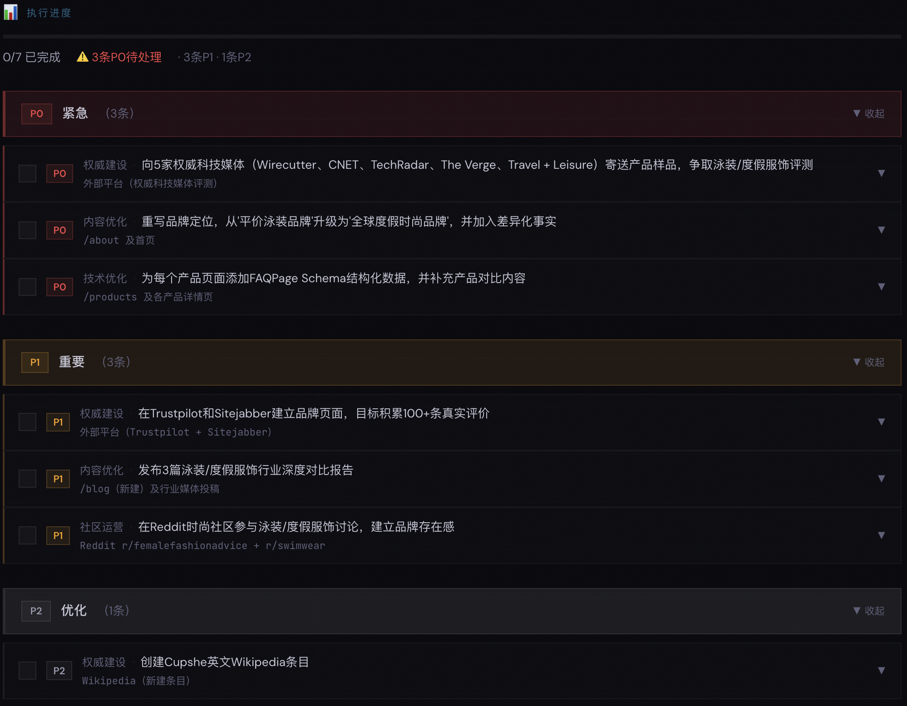 | 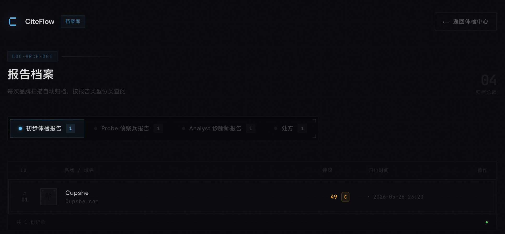 |

---

## Architecture

```
User Input (domain + brand_name)
  │
  ▼
Probe ──────────────────────────────────────────
  ├─ Brand Profiler (crawl website, extract identity)
  ├─ Query Expander (30 queries: A/B/C categories)
  ├─ Multi-Engine Search (ChatGPT + Gemini + Claude)
  ├─ Citation Analyzer (per-query citation detection)
  ├─ Market Mirror (AI perception of brand)
  ├─ Gap Analysis (self-image vs AI-image)
  ├─ Competitor Comparison (head-to-head analysis)
  └─ Company Scorer (5-dimension weighted score)
  │
  ▼ ProbeOutput (full structured data)
  │
Analyst ────────────────────────────────────────
  ├─ Context Builder (ProbeOutput → slim context)
  ├─ Rule Engine (15 rules, code-based detection)
  ├─ Knowledge Injection (vector search over 35 papers)
  └─ LLM Diagnosis (3-layer insight chain)
  │
  ▼ AnalystOutput (diagnosis + competitor gap)
  │
Doctor ─────────────────────────────────────────
  ├─ Prescription Context Builder
  ├─ Knowledge Injection (RAG matched to triggered rules)
  └─ LLM Prescription (P0/P1/P2 action items)
  │
  ▼ DoctorOutput (page-level prescriptions)
  │
Re-Probe (measure improvement, close the loop)
```

---

## Knowledge Base

| # | Paper | Key Finding |
|---|-------|-------------|
| 1 | GEO Foundation (arXiv:2311.09735) | Adding statistics to pages boosts AI visibility 15-30% |
| 2 | AI Disrupts Search (SIGIR 2026) | 51.5% of Google queries trigger AI-generated answers |
| 3 | Citation Absorption | Citations cluster around authority domains; smaller brands need 3rd-party endorsements |
| 4 | Cultural Encoding | Brand identity must survive "cultural compression" in AI summaries |
| 5 | Discovery Gap | Startup brands face structural invisibility in AI search results |
| 6 | Structural Feature Engineering | Page structure features drive +22% AI retrieval hit rate |
| 11 | Multimodal GEO | VLM search engines jointly encode image + text; visual consistency matters |
| 12 | IF-GEO | Cross-query stability optimization via diverge-then-converge framework |
| 14 | Don't Measure Once | AI search results are probabilistic; single measurements are unreliable |
| 19 | Think Before Writing | Feature-level optimization outperforms word-level tweaking |
| 21 | Beyond RAG | RAG retrieval is inherently probabilistic — confidence decays across queries |
| 22-31 | Adversarial Risks | Prompt injection, STS poisoning, embedding attacks on AI search rankings |
| 34 | SAGEO Arena | Structured data drives retrieval (+22%), body text drives generation |
| 35 | CC-GSEO | Being cited ≠ being recommended ≠ being accurately described |

Full paper list: `knowledge/INDEX.md`

---

## Contributing

See [CONTRIBUTING.md](CONTRIBUTING.md) for setup, guidelines, and how to add new diagnostic rules or knowledge papers.

---

## License

CiteFlow is [AGPL-3.0](LICENSE). The knowledge base (papers, strategies, templates) is CC-BY-4.0.

---

## Ecosystem

- **[geo-knowledge](https://github.com/fong-foo/geo-knowledge)** — CITE framework documentation
- **[ai-crawlers](https://github.com/fong-foo/ai-crawlers)** — AI crawler UA detection (merged into tools/)
- **[llms-txt](https://github.com/fong-foo/llms-txt)** — llms.txt generator (merged into tools/)

---

Built by [CiteFlow Contributors](https://github.com/fong-foo/citeflow/graphs/contributors).
